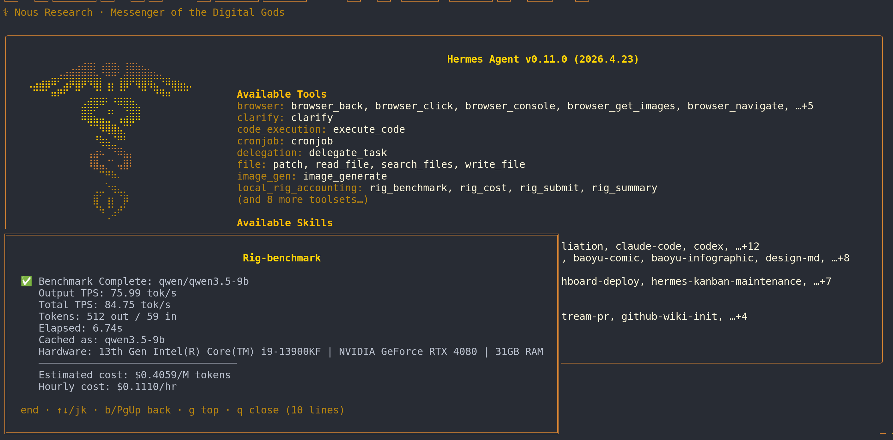
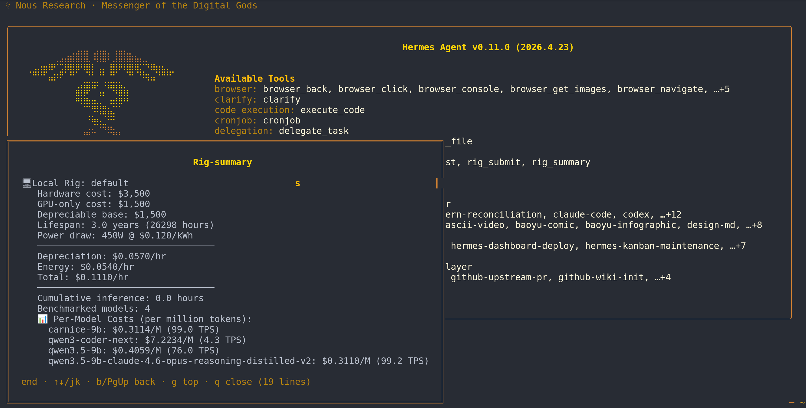
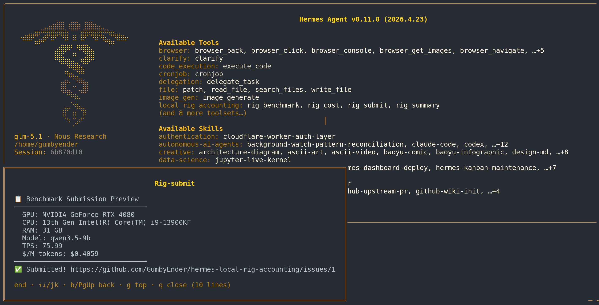
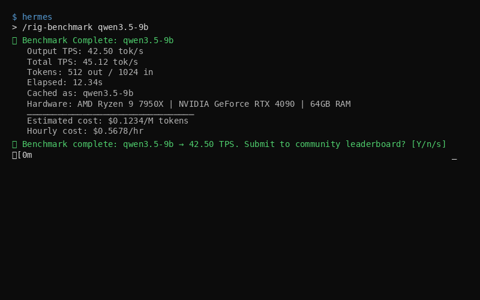

# hermes-local-rig-accounting

> Transparent per-token cost accounting for local LLM inference in Hermes Agent.

Local LLM inference isn't free — every token costs electricity, hardware depreciation, and opportunity cost. This plugin surfaces those real costs alongside cloud provider pricing so you can make informed decisions.

## Install

```bash
hermes plugins install GumbyEnder/hermes-local-rig-accounting
```

Or manually:
```bash
git clone https://github.com/GumbyEnder/hermes-local-rig-accounting \
  ~/.hermes/plugins/local-rig-accounting
```

## Configure

Add to your `config.yaml`:

```yaml
plugins:
  enabled:
    - local-rig-accounting

local_rig:
  hardware_cost_usd: 5000        # Your total rig cost
  lifespan_years: 3              # Expected useful lifespan
  gpu_only_cost_usd: 2500        # Optional: GPU cost as depreciation base
  avg_power_watts: 450           # Average power draw during inference (W)
  electricity_rate_per_kwh: 0.15 # Your local electricity rate ($/kWh)
  auto_submit: false            # When true, auto-submit benchmarks to leaderboard (requires gh auth). Default: false.
```

**Don't know your electricity rate?** Use auto-lookup:
```yaml
local_rig:
  electricity_rate_per_kwh: auto   # Auto-lookup from built-in database
  electricity_region: Texas        # US state, country, or abbreviation
```

**Privacy note:** All cost data stays local on your machine. No external calls, no telemetry.

## Usage

```bash
# Benchmark your local model (do this first!)
# After a successful benchmark:
#   - If auto_submit: true and gh auth OK → submits automatically
#   - Otherwise → run /rig-submit manually to share
/rig-benchmark qwen3.5-9b

# See your rig economics
/rig-summary

# Check current session cost
/rig-cost

# Look up electricity rates by region
/rig-rates Texas

# Submit your benchmark to the community leaderboard (manual, or set auto_submit: true)
/rig-submit qwen3.5-9b
```

Or use the LLM tools directly:
- `rig_cost` — Estimate cost for a model + token count
- `rig_summary` — Full rig economics dashboard  
- `rig_benchmark` — Benchmark a local model's TPS
- `rig_rates` — Look up regional electricity rates
- `rig_submit` — Submit benchmark to community leaderboard

## In Action

### `/rig-benchmark` — Measure throughput


### `/rig-summary` — See your rig economics


### `/rig-submit` — Share with the community


### Auto-submit after benchmark (when enabled)


## Cost Model

The plugin uses a transparent, auditable cost model:

| Component | Formula |
|-----------|---------|
| **Depreciation** | `gpu_only_cost / (lifespan_years × 8766 hrs)` per actual inference hour |
| **Energy** | `(avg_power_watts / 1000) × electricity_rate_per_kwh` per hour |
| **Per-token** | `total_hourly_cost / (TPS × 3600) × 1,000,000` = $/M tokens |

### Example

| Parameter | Value |
|-----------|-------|
| GPU cost | $1,500 |
| Lifespan | 3 years (26,298 hrs) |
| Power | 450W @ $0.12/kWh |
| Measured TPS | 50 |
| **Depreciation** | $0.057/hr |
| **Energy** | $0.054/hr |
| **Total** | $0.111/hr |
| **Cost** | **$0.62/M tokens** |

## Multi-Rig Support

For multiple machines, add a `rigs:` list and set `hostname:` for auto-detection:

```yaml
local_rig:
  hostname: desktop-server
  hardware_cost_usd: 5000
  avg_power_watts: 450
  electricity_rate_per_kwh: 0.15
  rigs:
    - label: laptop
      hostname: my-laptop
      hardware_cost_usd: 2000
      avg_power_watts: 120
      electricity_rate_per_kwh: 0.12
```

Hermes will auto-select the matching rig profile based on hostname.

## How It Hooks In

| Hook | What It Does |
|------|-------------|
| `post_api_request` | Tracks token counts from local providers |
| `on_session_start` | Resets session accumulators |
| `on_session_finalize` | Persists cumulative inference hours |

Only local providers are tracked (localhost, lmstudio, ollama, vllm, etc). Cloud API calls are ignored.

## License

MIT
